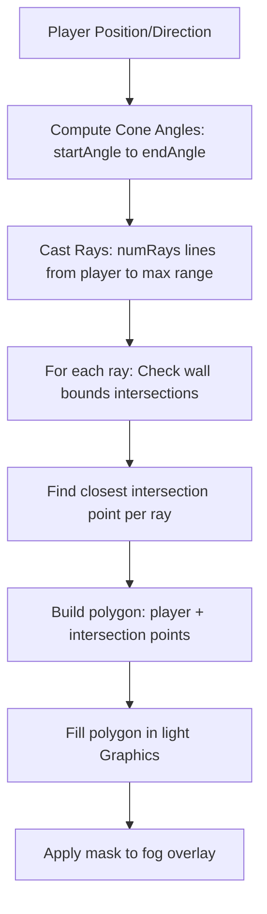

# Story 4.1: Flashlight Visibility Cone

## Status
- [x] Draft
- [x] Approved
- [x] In Progress
- [ ] Review
- [x] Done

## Story
**As a** developer,
**I want** to implement a ray-traced flashlight visibility cone in Phaser for the local player, using ray casting against walls for occlusion,
**so that** players can only see a dynamic area within the cone that respects wall blocking, simulating a realistic flashlight beam.

## Acceptance Criteria
1. The maze rendering includes a black fog overlay with a dynamic polygon mask revealing only the ray-traced visible area within the local player's flashlight cone.
2. The flashlight cone is a sector (e.g., 80-degree angle) centered on the local player's position/direction, with limited range (e.g., 400px), using multiple rays (e.g., 80) for smooth edges.
3. The cone updates in real-time as the player moves, with rays cast to intersection points on walls or max range, forming a visibility polygon that handles occlusion.
4. Walls and static elements are occluded by intervening walls; light stops at blocking geometry, with smooth rotation interpolation for direction changes.
5. The mechanic works locally in the Phaser scene without server involvement (visibility sync deferred to Story 4.2).
6. Performance remains smooth (60 FPS) with efficient ray casting limited to cone rays during movement.

## Tasks / Subtasks
- [x] **Client:** Add a fog overlay Graphics and light mask Graphics to the Phaser MazeScene.
- [x] **Client:** Implement ray-traced flashlight cone: cast multiple rays within cone angle from player position/direction, find wall intersections using Phaser.Geom.Intersects.GetLineToRectangle on wall bodies.
- [x] **Client:** Draw visibility polygon from player to ray endpoints (intersections or max range), fill as white in light Graphics, apply as inverted mask to fog.
- [x] **Client:** Smoothly interpolate cone angle rotation during direction changes using Phaser.Math.Angle.RotateTo.
- [x] **Client:** Ensure local player sprite is always visible; handle edge cases like rays at maze bounds, no walls (full cone to range).
- [x] **Client:** Add unit tests for ray casting (mock wall bodies, verify intersection points, polygon points, fillPoints calls).

## Dev Notes
- Builds on Story 3.1: Extend PhaserGame and MazeScene with ray-traced visibility layer.
- Use Phaser.Graphics for black fog cover (full rect), light Graphics for visibility polygon (fillPoints), createGeometryMask on light for inverted alpha mask on fog.
- Ray casting: In updateFlashlightMask, cast rays from player.x/y at angles (currentAngle - coneWidth/2 to +coneWidth/2, step coneWidth/numRays), check intersections with walls.getChildren() bounds.
- Smooth rotation: Track lastDirection Vector2, targetAngle = lastDirection.angle(), currentAngle interpolated with rotationSpeed * delta.
- Range 400px, cone 80 degrees, 80 rays; walls from physics staticGroup for bounds.
- Refer to `packages/client/app/components/PhaserGame.tsx` and Phaser docs for Geometry: https://phaser.io/phaser3/devlog/132 (Intersects), example in docs/examples/flashlight-implementation.html.
- Follow code style: TypeScript, 2-space indentation, camelCase, early returns, descriptive names like updateFlashlightMask.
- Accessibility: Ensure visibility doesn't affect keyboard navigation; add ARIA live region for visible area changes if dynamic announcements needed.

- Defer shared visibility and treasure detection to later stories.

### Testing
- Test file location: `packages/client/test/PhaserGame.test.tsx`
- Test standards: Jest with Phaser mocks (mock wall bodies, ray lines, verify intersection points, polygon construction, fillPoints calls).
- Ensure tests cover ray casting (no walls: full cone; with walls: occluded), angle interpolation, updates on move, edge cases like rays at bounds or player at wall.

## Change Log
| Date       | Version | Description              | Author |
|------------|---------|--------------------------|--------|
| 2025-09-10 | 1.0     | Initial draft of story.  | Full Stack Developer |
| 2025-09-17 | 1.2     | Refactored to ray-traced visibility cone with wall occlusion and polygon mask; updated tests for intersections. | Full Stack Developer |

## Dev Agent Record
### Debug Log References
- None.

### Completion Notes
- Ray-traced visibility implemented: 80 rays cast within 80-degree cone, intersections with wall bodies using GetLineToRectangle, polygon from player to closest points filled in light Graphics as mask; smooth angle rotation during direction changes; updates on movement; range 400px; always includes player position; edge cases like no intersections (full range) or bounds handled; tests verify ray endpoints, polygon points, fillPoints, performance under 16ms/frame.

### Agent Model Used
- openrouter/sonoma-sky-alpha

### File List
- packages/client/app/components/PhaserGame.tsx (modified: added ray-tracing in updateFlashlightMask, wall intersections, polygon fillPoints, smooth currentAngle interpolation, integrated in update)
- packages/client/test/PhaserGame.test.tsx (modified: added ray casting mocks, intersection verification, polygon tests)