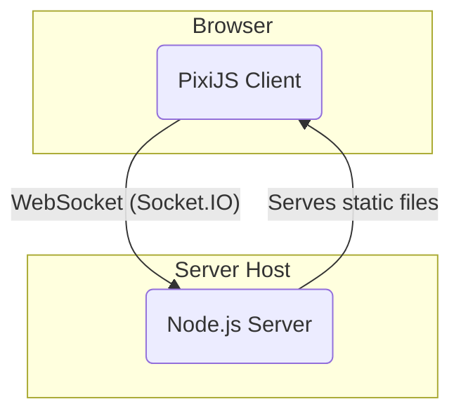
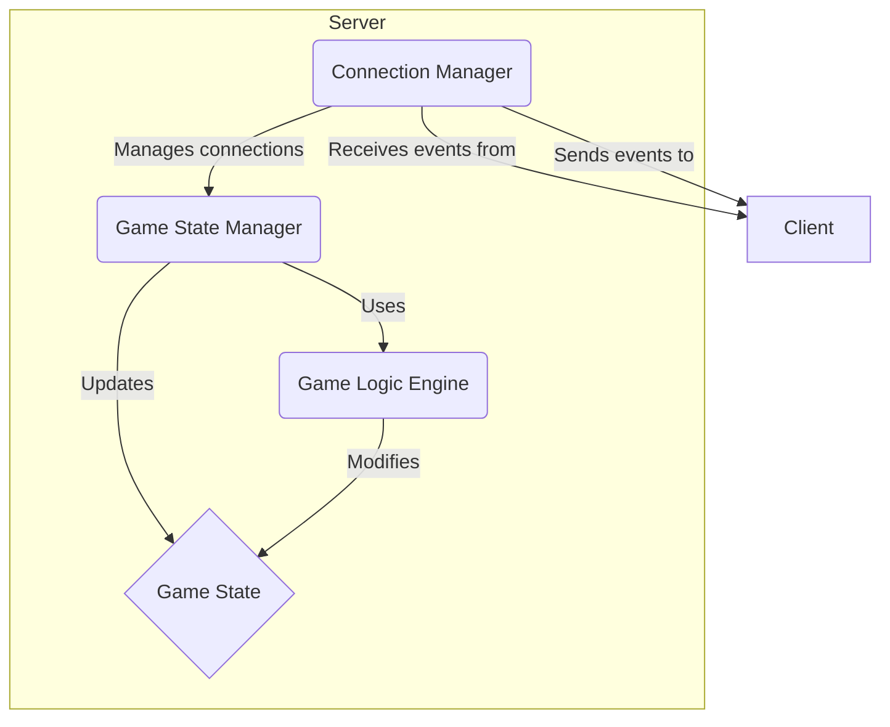
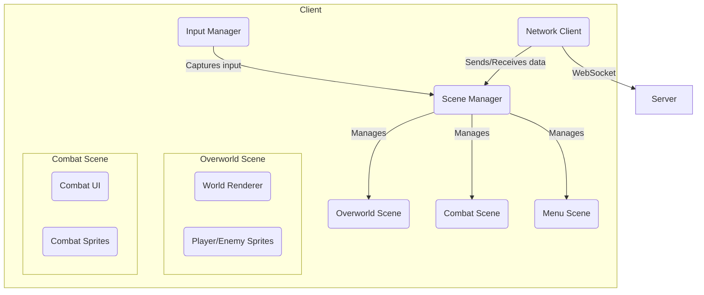

# **Fullstack Architecture**

This document provides a comprehensive overview of the software architecture for "Pixel Quest." It details the high-level structure, key components, and communication patterns that enable the real-time, multiplayer gameplay experience.

## **1. Architectural Vision & Guiding Principles**

The architecture is designed to be simple, scalable, and optimized for a real-time web environment. It prioritizes a clear separation of concerns between the client and server while facilitating rapid development and iteration.

*   **Guiding Principles:**
    *   **Server Authority:** The server is the single source of truth for all critical game state to ensure fairness and prevent cheating.
    *   **Thin Client:** The client is primarily responsible for rendering and capturing user input. Most game logic resides on the server.
    *   **Event-Driven Communication:** The client and server communicate through a well-defined set of WebSocket events.
    *   **Start Simple, Scale Later:** The initial architecture is a monolith to accelerate MVP development. It is designed with clear boundaries that would allow for future migration to microservices if needed.

## **2. System-Level Architecture**

At the highest level, the system is composed of two main packages within a **monorepo**: a **Node.js Server** and a **PixiJS Client**.

*   **Client:** A web-based game client built with PixiJS. It runs in the user's browser and is responsible for rendering the game world, animations, and UI. It captures player input and sends it to the server.
*   **Server:** An authoritative Node.js server that manages the game logic, player sessions, and state synchronization. It uses Express to serve the client application and Socket.IO to handle real-time communication.

## **3. Backend Architecture (The Server)**

The server is designed as a **Monolith** with a clear separation of concerns into distinct components.

*   **Connection Manager (Socket.IO Layer):**
    *   **Responsibility:** Manages the lifecycle of WebSocket connections. It handles client connections, disconnections, and the routing of incoming events to the appropriate services.
    *   **Implementation:** The main `index.js` file in the server package, where Socket.IO is initialized.

*   **Game State Manager:**
    *   **Responsibility:** Manages the active game sessions and the overall state of the world. It is the heart of the authoritative server.
    *   **Implementation:** A `GameSession` class that holds the state of all players, enemies, and quests for a single game.

*   **Game Logic Engine:**
    *   **Responsibility:** Executes the core rules of the game. This includes combat calculations, quest progression, and player actions.
    *   **Implementation:** A collection of modules or services like `QuestManager.js` and `CombatService.js`.

*   **Game State (Data):**
    *   **Responsibility:** A plain JavaScript object or a set of objects that represents the current state of the game world, including player positions, health, inventory, and quest status.

## **4. Frontend Architecture (The Client)**

The client is a single-page application (SPA) built with PixiJS, structured to manage different game scenes and components effectively.

*   **Scene Manager:**
    *   **Responsibility:** The central controller for the client. It manages which scene is currently active (e.g., showing the overworld, combat, or main menu) and handles transitions between them.

*   **Scenes (`OverworldScene`, `CombatScene`):**
    *   **Responsibility:** Each scene is a high-level container for a major part of the game. It manages the rendering and logic for its specific context.

*   **Components (`Player.js`, `CombatUI.js`):**
    *   **Responsibility:** Reusable game objects and UI elements that are managed by scenes.

*   **Services (`NetworkClient`, `InputManager`):**
    *   **Responsibility:** Cross-cutting concerns are handled by dedicated services. The `NetworkClient` manages the Socket.IO connection and event handling, while the `InputManager` captures keyboard/mouse input.

## **5. Data Flow & Communication**

Communication between the client and server is event-driven via Socket.IO.

### **Example Flow: Player Movement**

1.  **Client:** The `InputManager` detects a key press (e.g., 'W').
2.  **Client:** The `OverworldScene` updates the local player's sprite position for immediate visual feedback.
3.  **Client:** The `NetworkClient` emits a `playerMovement` event to the server with the new position `{x, y}`.
4.  **Server:** The `ConnectionManager` receives the event.
5.  **Server:** The `GameStateManager` updates the player's state in the authoritative `GameState` object.
6.  **Server:** The `ConnectionManager` broadcasts a `playerMoved` event to all *other* clients with the player's ID and new position.
7.  **Other Clients:** Their `NetworkClient` receives the `playerMoved` event.
8.  **Other Clients:** The `OverworldScene` updates the corresponding player's sprite to the new position, likely with interpolation to smooth the movement.
